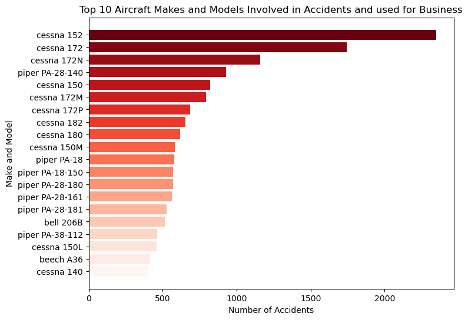
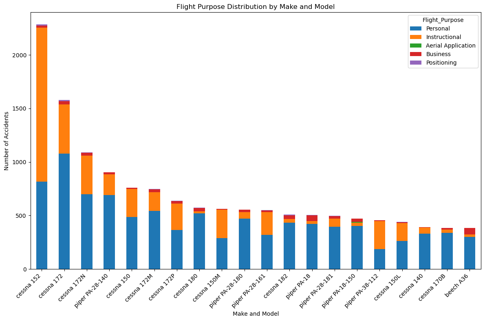
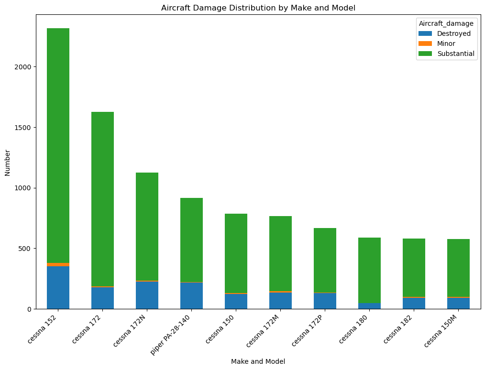
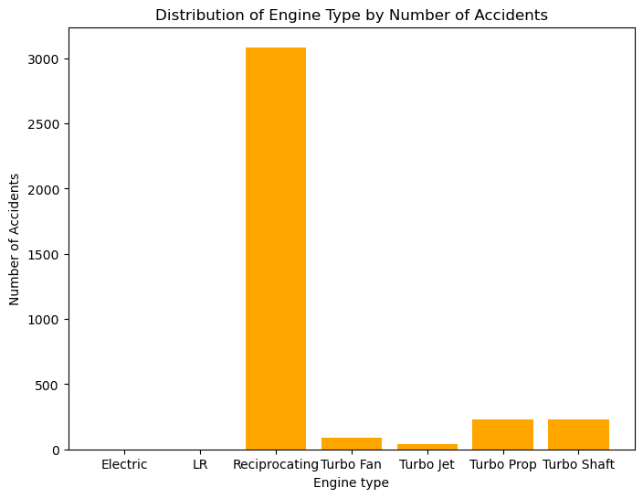
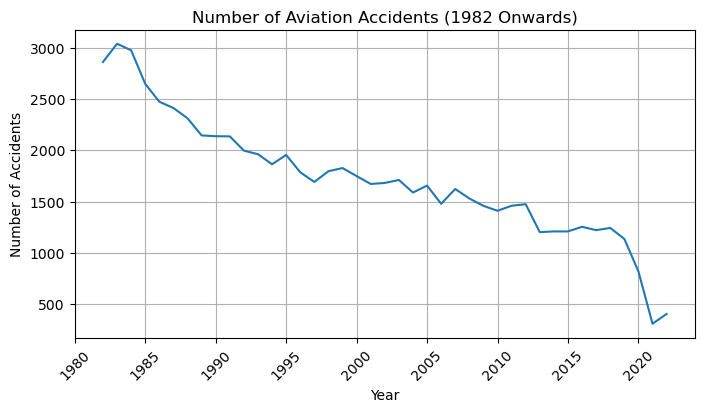

# Aviation Risk Analysis for Company X

## Overview
This repository contains an analysis aimed at identifying the lowest risk aircraft for Company X as it expands into the aviation industry. The analysis leverages historical accident data to provide actionable insights for stakeholders to make informed decisions about aircraft purchases.

## Business Understanding
### Stakeholder
- **Company X**: An organization seeking to diversify its portfolio by entering the aviation sector for commercial and private enterprises.

### Key Business Questions
1. Which aircraft models are the lowest risk for Company X to operate?
2. What are the main factors contributing to aviation accidents?
3. How can Company X minimize risks when purchasing aircraft for business use?

## Data Understanding and Analysis
### Source of Data
- **National Transportation Safety Board (NTSB)**: Aviation accident data from 1962 to 2023, obtained from Kaggle.

### Description of Data
The dataset includes information on civil aviation accidents and selected incidents in the United States and international waters. Key attributes include:
- Investigation Type
- Event Date
- Injury Severity
- Aircraft Damage
- Number of Engines
- Engine Type
- Purpose of Flight
- Fatal Injuries
- Serious Injuries
- Minor Injuries
- Uninjured
- Weather Condition
- Make
- Model

### Visualizations
1. **Top Aircraft Makes and Models Involved in Accidents**
   
   - This bar chart shows the number of accidents for the top 10 aircraft makes and models.
   - Cessna and Piper are involved in the most accidents.

2. **Flight Purpose Distribution by Make and Model**
   
   - This stacked bar chart displays the distribution of flight purposes for different makes and models.
   - Personal and instructional uses lead the flight purposes with the most accidents.

3. **Aircraft Damage Distribution by Make and Model**
   
   - This bar chart shows the distribution of aircraft damage by make and model.
   - The Cessna models often suffer substantial damage.
4. **Engine Type Involved in Accidents**
   
   - This bar chart shows the distribution of aircraft damage by make and model.
   - The Cessna models often suffer substantial damage.
5. **Yearly Distribution of Accidents**
   
   - There's a dramatic decrease of accidents across the years.

Access the dashboard visualization [here](https://public.tableau.com/app/profile/eric.muema/viz/project-wb-06-2024-EM/ACCIDENTSANALYSIS?publish=yes) 

## Conclusion
### Summary of Conclusions
1. **Cessna 560 Identified as Lowest Risk Aircraft**
   - Based on historical data, the Cessna 560 is recommended due to its lower accident frequency, minor damage reports, and the use of reliable Turbo Jet engines.
   
2. **Engine Type Matters**
   - Turbo Jet and Turbo Fan engines are more reliable for business purposes, with fewer accidents compared to reciprocating engines used in smaller aircraft.
   
3. **Decreasing Trend in Aviation Accidents**
   - There has been a significant decrease in the number of aviation accidents over the years, indicating improvements in aviation safety.

### Contact Information
For further inquiries, please contact:
- **Name:** Eric Muema
- **Email:** [ericmuema02@gmail.com]
- **Phone:** [0711126595]
- **LinkedIn:** [Eric Muema](https://www.linkedin.com/in/eric-muema-730103217/)
  
